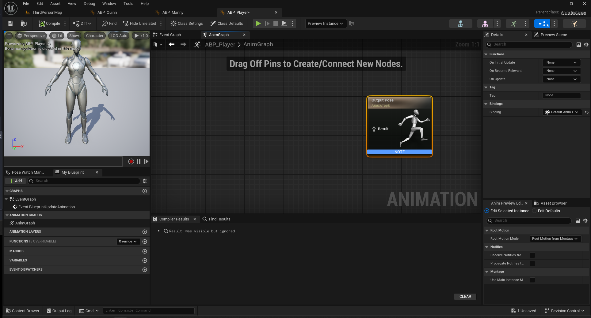
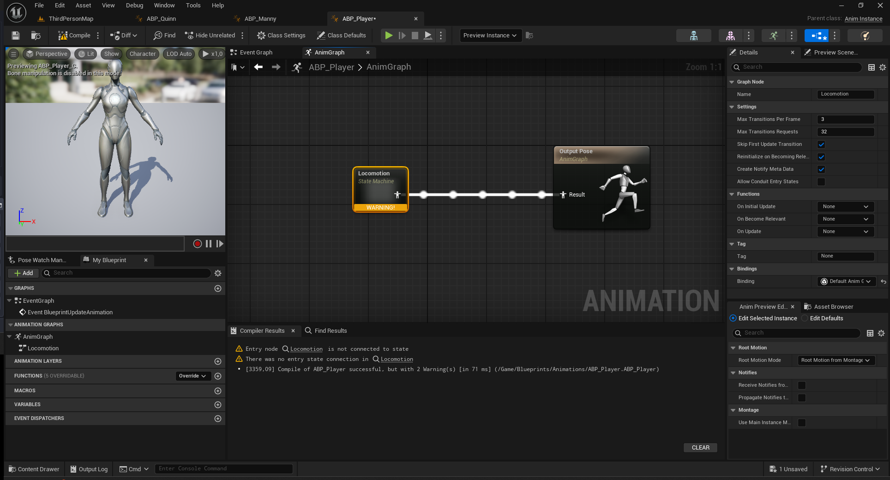
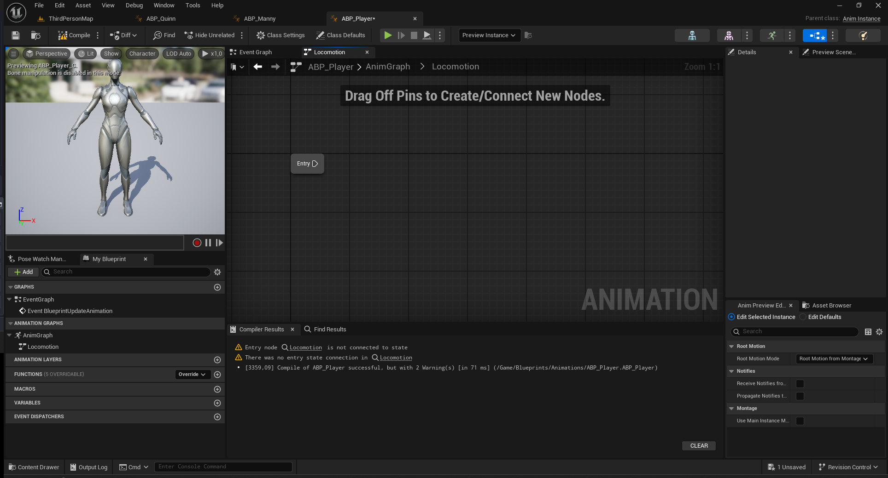
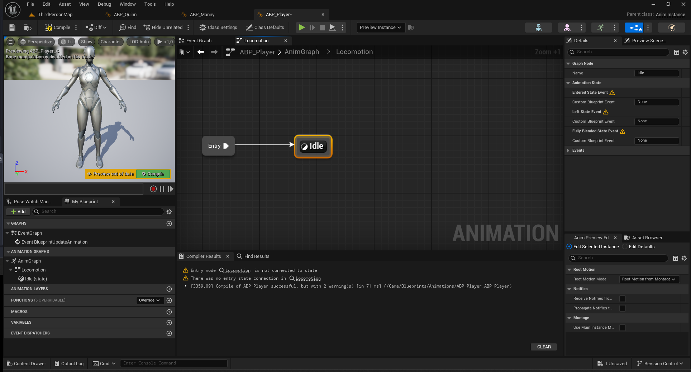
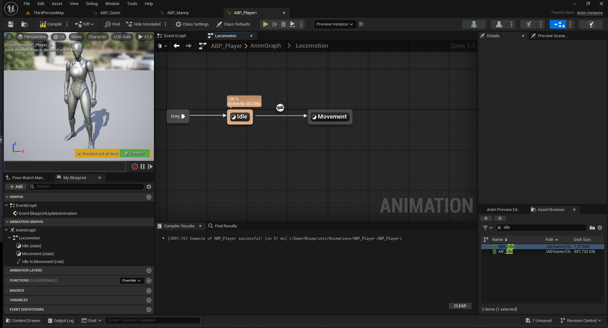
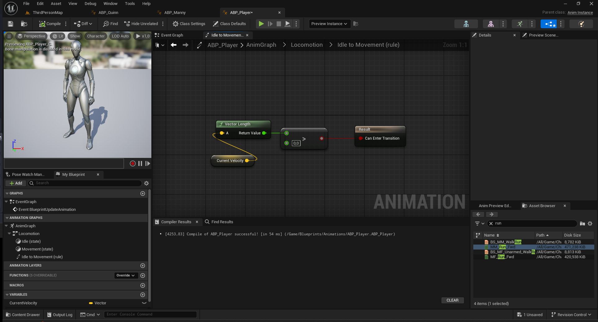
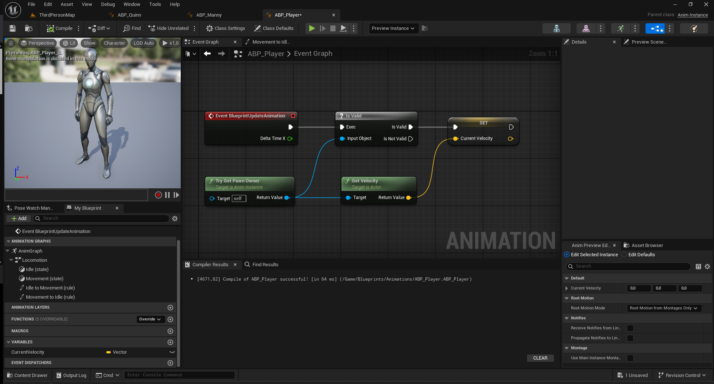

## Animation Blueprint

We are going to setup a simple animation blueprint with a state machine for the UE5 Mannequins Manny.
Our character will have idle and moving animations.
I use Unreal Engine 5.5.

1 - First create a new project in Unreal or use an existing one. I created a fresh new project with the third person template. Our character has already an animation blueprint but we will create a new one to do it from scratch.

2 - Create a new Animation Blueprint: right click in the content browser > Animation > Animation Blueprint > Choose the skeletal mesh SK_Mannequin.
Then the new file. I named it ABP_Player. ABP for Animation Blueprint.

Open the Animation blueprint by double clicking.
The animation blueprint has two parts: the anim graph and the event graph. The anim graph decides of the final animation. It's the Output Pose node. To decide the anim graph use different values like character speed for example.
Theses values will be set in the event graph.

3 - In the Anim Graph of the Animation blueprint add a node State Machine and give it a name "Locomotion". This state machine will be responsible of the transition between Idle (no movement) and Movement. Connect the state machine to the Output Pose node. For now, it shows a warnings because our state machine is empty. Let's open it.

4 - There is only an Entry node. Drag from the Entry node to add a State node. Call it Idle. This will be the default state when the character is not moving.

7 - Double click on Idle state to open it. Drag and drop an idle animation from the assets browser and the right and connect it to the output animation pose. Click on the idle animation node and in the details panel on the right search for looping animation and check it. Now the idle animation will loop.

8 - Don't forget to save and go back to the Locomotion State machine. We need to create the Movement state. Drag a new state from Idle and name it Movement.

9 - Open the Movement state and like for the Idle, drag and drop an animation (walk of run), connect it to the Output Animation Pose and make it loop. On the preview on the left nothing change. It's normal. We need to decide when the state machine transition from idle to movement.

10 - Go back to the locomotion State machine. Open the transition rule between idle and movement. This is where we tell when the animation goes from idle to movement. Double click on the transition rule between idle and movement.
We want to change animation when the character has a speed > 0. For now we don't have access to the character speed. We will get it later in the event graph of the animation blueprint. For now, we will create a new variable of type Vector. Name it CurrentVelocity. This variables will holds our character speeds.

Drag and drop it in the Idle to Movement rule. Get its Vector length and check if it greater than 0. If true connect to Can enter transition node. 
Here we are just saying: if the character speed is greater than 0 then update state to movement (then play movement animation).

11 - We now need to do the same for the transition from Movement to Idle when the character stops moving. Go back to locomotion, drag from movement and drop on Idle. It creates a new transition rule from Movement to idle. 
We just need to test if character speed is equals to 0.

12 - Now we need to set the CurrentVelocity variable in the event graph
Open the Event Graph of the Animation Blueprint.
Add an Event Blueprint Update Animation node (this updates the animation every frame).
Drag out from the execution pin and add an Is Valid node.
Connect Try Get Pawn Owner to Is Valid (this ensures the character exists before updating values).
Drag out from Try Get Pawn Owner and cast it to ThirdPersonCharacter (or your character’s blueprint name).
From the casted node, Get Velocity and set it as CurrentVelocity.

13 - Test the Animation Blueprint
Assign ABP_Player to the character’s Mesh Component in the ThirdPersonCharacter Blueprint.
Press Play to test.
The character should now transition smoothly between idle and movement animations.